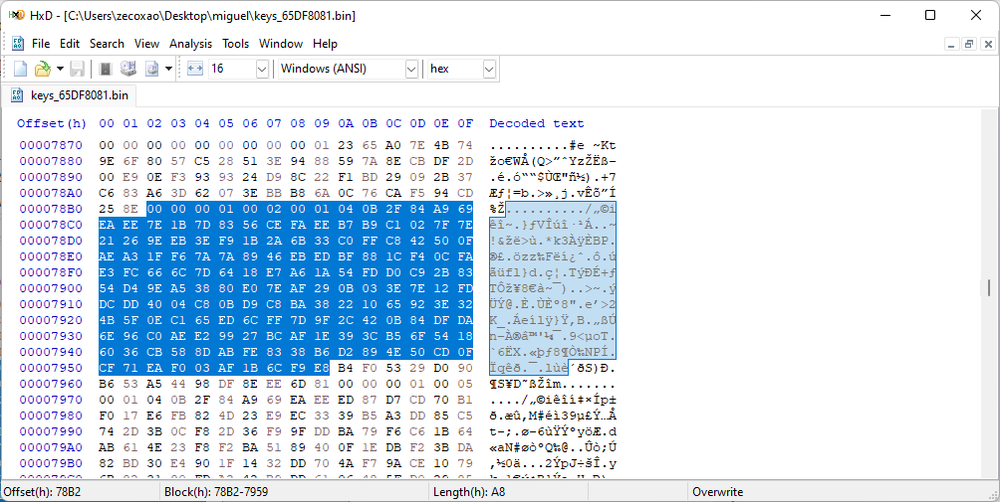

; https://www.psx-place.com/threads/playstation-portable-cex2dex-tutorial.37260/

First of all, thanks to the source of KICHO & DENCHO factory firmware. Inside it you can find several fuseid derived algos that you can use to generate idstorage keys as well as umd keys.

Thanks to Mathieulh, Davee, Proxima, CelesteBlue, and of course Dark_Alex. DAX's work on Despertar del Cementerio was crucial to get this to work properly in the first place.

Onwards to the tutorial, but first a warning:

First, please understand that this is dangerous to try on consoles above the psp brite 3000 (it should work on those, but it's not advisable, at least not until we have a custom IPL with backup feature)

Tools needed:

PSP Tool 1.0 (you can find this tool on brewology, it gives you a multitude of options to create Pandora and also MMS as well as give you infos about the console)

balika011's DC-M33 (latest release which supports DTP-H1500), for installing 5.02 TT M33 if you want

psp_cex2dex.rar (contains the necessary tools to generate your own certificate)

pysweeper (https://github.com/khubik2/pysweeper) and baryon sweeper (3000) OR Original Battery for 1000 OR Pandora Battery

HxD hexeditor

darthsternie.net (good source of TT pups)

PSP 1000, 2000 or 3000 (baryon sweeper required for 3k brite!)
That's it! You should be good to go.

Steps:

1- Download PSP Tool 1.0 from brewology site and place it on your PSP
2- Run PSP Tool (warning, you need a cfw for it to work!), you should be greeted with several options
3- Select Idstorage -> Backup IdStorage
4- Follow the on screen prompts. this will backup the idstorage to a file called keys_XXXXXXXX.bin, these are your idstorage keys in nand format, where XXXXXXXX is your nand seed.
5- Open up your keys_XXXXXXXX.bin in HxD
6- Search for the hex string ( 00 00 00 01 )
7- At the 7th or 8th ocurrence you should see 0x38 bytes of random stuff and then 00 00 00 01 00 XX where XX is the byte you want to change (we'll leave that for later, since we need to forge the cmac first before trying anything funny)
8- Select exactly 0xA8 bytes from that point onward. Here is what mine looks like:

Make sure you also note down the next 0x10 bytes (these will be used to validate the certificate as well as if you're doing everything properly)

9- On the psp_cex2dex program, replace buf2 with those bytes, this will be your idps certificate without the cmac.

10- Again on PSP Tool 1.0, select About -> System Information -> (on sys info screen) push right once -> (on next screen) push right again, you should see the fuseid, it should be exactly 6 bytes. this is the value that generates all of the perconsole keys. we'll use this value to get our own cmac key for our own console.

11- Again on the psp_cex2dex program, replace g_fuseid (currently u_int64_t g_fuseid = 0x570804b80a0f;) to your own fuseid.

12- Compile the program (any gcc compiler should work, linux, wsl, cygwin gcc, mingw, etc) with the following :

gcc main.c ids/aes_core.c -o cmac_gen

13- run cmac_gen with the following:

./cmac_gen

if successfully ran it'll display the following

final certificate is :
00 00 00 01 00 02 00 01 04 0B 2F 84 A9 69 EA EE
7E 1B 7D 83 56 CE FA EE B7 B9 C1 02 7F 7E 21 26
9E EB 3E F9 1B 2A 6B 33 C0 FF C8 42 50 0F AE A3
1F F6 7A 7A 89 46 EB ED BF 88 1C F4 0C FA E3 FC
66 6C 7D 64 18 E7 A6 1A 54 FD D0 C9 2B 83 54 D4
9E A5 38 80 E0 7E AF 29 0B 03 3E 7E 12 FD DC DD
40 04 C8 0B D9 C8 BA 38 22 10 65 92 3E 32 4B 5F
0E C1 65 ED 6C FF 7D 9F 2C 42 0B 84 DF DA 6E 96
C0 AE E2 99 27 BC AF 1E 39 3C B5 6F 54 18 60 36
CB 58 8D AB FE 83 38 B6 D2 89 4E 50 CD 0F CF 71
EA F0 03 AF 1B 6C F9 E8 B4 F0 53 29 D0 90 B6 53
A5 44 98 DF 8E EE 6D 81

where the first 0xA8 bytes are the cert and the last 0x10 bytes (B4 F0 53 29 D0 90 B6 53 A5 44 98 DF 8E EE 6D 81) are the cmac (you can see this in the idstorage you just dumped)

as you can see my binary already contains the target id changed to 02 (00 00 00 01 00 02 <-) for you to change yours, you need to go to the sixth byte (in this case it was 05, Europe) and change it to 02 (TT Testkit)

14- If / when you change the byte, the cmac will also change, so do this accordingly (compile and run) to know final cmac.

15- After you have done all this it's time to modify the two old sections where this appears.

The first section as well as the second one are identical so search for the old pattern first, then swap with the new bytes (you can use CTRL + B for this) in the keys_XXXXXXXX.bin file.

16. after you're set and done, place the file in the root of the memory stick.

17. now, in PSP Tool 1.0 (here comes the dangerous part) select IdStorage->Restore

18. follow the on screen instructions (say yes to all) and the program should restore it.

19. exit the program. From now on you have two options:

20.1 If you have a phat 1000 you can go to ofw DEX (6.60 TT works with the debug settings and install pkg files)

20.2 If you have a slim 2000 or a brite 3000 you can install 5.02 M33 TT (this also works on the phat 1000 btw)
There are tutorials for this so i won't bother you explaining how to do it (google is your friend)